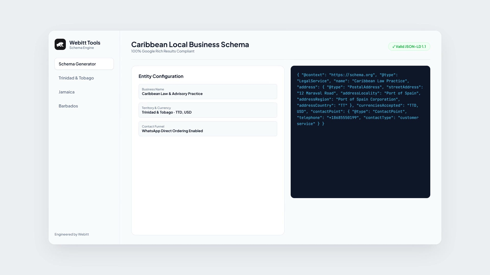

# Caribbean Business Schema & Local SEO Toolkit

[](https://thewebitt.com)
[](https://www.typescriptlang.org/)
[](https://opensource.org/licenses/MIT)
[](https://search.google.com/test/rich-results)

[](https://webittdigital.github.io/caribbean-business-schema/)

> **Live Interactive Generator & Video Walkthrough:** [webittdigital.github.io/caribbean-business-schema](https://webittdigital.github.io/caribbean-business-schema/)

A lightweight TypeScript and JSON-LD utility for generating Schema.org structured data tailored specifically for Caribbean businesses, service providers, and modern web applications.

Standard Schema generators are designed primarily for North American and European conventions. They frequently cause validation issues for Caribbean businesses due to missing postal codes, parish or corporation regional boundaries, WhatsApp-driven commercial channels, and multi-currency pricing (TTD, JMD, BBD, USD).

This toolkit handles regional nuances and outputs 100% Google-compliant structured data for Google Maps, Local Search, and Generative AI engines (ChatGPT, Google Gemini).

---

## Features

- **Regional Address Localization:** Pre-configured address schemas for Trinidad and Tobago, Jamaica, Barbados, Guyana, Bahamas, and Eastern Caribbean states.
- **Graceful Postal Code Handling:** Omits or formats postal fields to prevent Google Search Console validation errors.
- **Multi-Currency Support:** Native support for dual-currency businesses (TTD, JMD, BBD, XCD, USD).
- **WhatsApp Commercial Contact Points:** Embeds valid ContactPoint schemas for businesses taking orders or inquiries via WhatsApp.
- **AI and Knowledge Graph Ready:** Formats semantic entities to maximize citations in AI search engines and Google local search packs.
- **Zero Dependencies:** Pure TypeScript / JavaScript — easily drop into Next.js, Astro, Remix, WordPress, or custom web applications.

---

## Quick Start

### Installation

```bash
git clone https://github.com/webittdigital/caribbean-business-schema.git
```

### Usage (TypeScript / Next.js / Astro)

```typescript
import { generateCaribbeanLocalBusiness } from './src/schema';

const businessSchema = generateCaribbeanLocalBusiness({
  name: "Sample Law Practice",
  businessType: "LegalService",
  url: "https://example.com",
  telephone: "+1-868-555-0199",
  whatsapp: "+18685550199",
  currenciesAccepted: ["TTD", "USD"],
  address: {
    streetAddress: "12 Maraval Road",
    addressLocality: "Port of Spain",
    addressRegion: "Port of Spain Corporation",
    addressCountry: "TT"
  },
  geo: {
    latitude: 10.6653,
    longitude: -61.5189
  },
  openingHours: ["Mo-Fr 08:00-16:30"]
});

console.log(JSON.stringify(businessSchema, null, 2));
```

### Output (Google JSON-LD)

```json
{
  "@context": "https://schema.org",
  "@type": "LegalService",
  "name": "Sample Law Practice",
  "url": "https://example.com",
  "telephone": "+1-868-555-0199",
  "address": {
    "@type": "PostalAddress",
    "streetAddress": "12 Maraval Road",
    "addressLocality": "Port of Spain",
    "addressRegion": "Port of Spain Corporation",
    "addressCountry": "TT"
  },
  "currenciesAccepted": "TTD, USD",
  "openingHours": [
    "Mo-Fr 08:00-16:30"
  ],
  "geo": {
    "@type": "GeoCoordinates",
    "latitude": 10.6653,
    "longitude": -61.5189
  },
  "contactPoint": {
    "@type": "ContactPoint",
    "telephone": "+18685550199",
    "contactType": "customer service",
    "availableLanguage": ["English"]
  }
}
```

---

## Supported Territories

| Territory | ISO Code | Regional Administrative Field |
| :--- | :--- | :--- |
| Trinidad and Tobago | TT | Regional Corporation / Borough / Parish |
| Jamaica | JM | Parish |
| Barbados | BB | Parish |
| Guyana | GY | Administrative Region |
| Bahamas | BS | Island District |
| Saint Lucia | LC | Quarter |

---

## Maintained By

Engineered and maintained by **[Webitt](https://thewebitt.com)**.

We build modern websites, scalable web applications, and high-performance digital solutions for businesses across the Caribbean and the US.

- **Website:** [thewebitt.com](https://thewebitt.com)
- **Services:** [Web Design & Development](https://thewebitt.com/services/web-design-development) | [Web Applications](https://thewebitt.com/services/web-applications) | [SEO Strategy](https://thewebitt.com/services/seo)
- **GitHub:** [@webittdigital](https://github.com/webittdigital)

---

## License

MIT © [Webitt](https://thewebitt.com)
